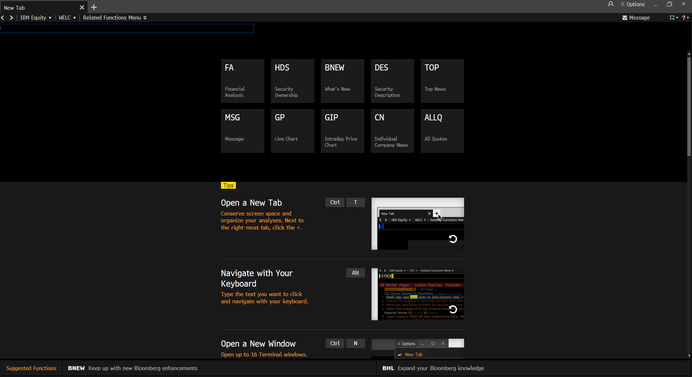
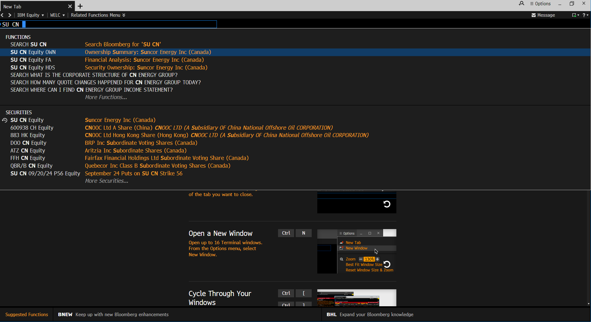
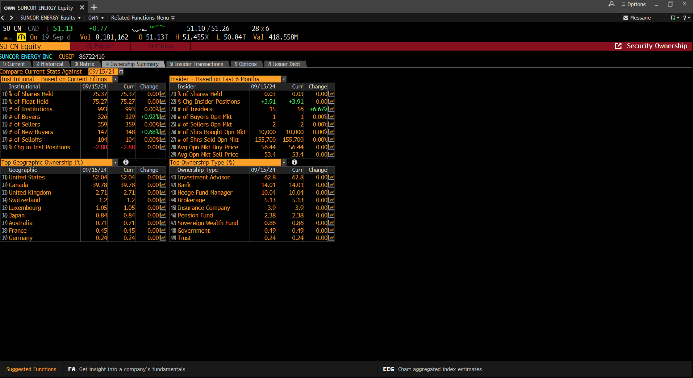
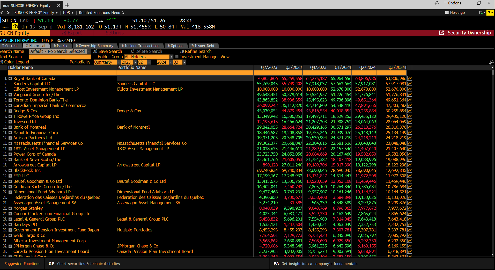
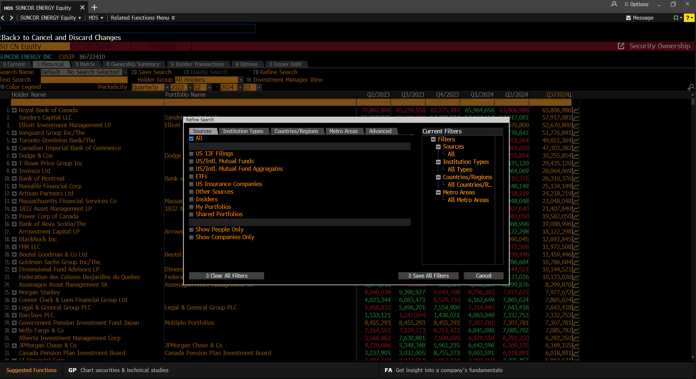
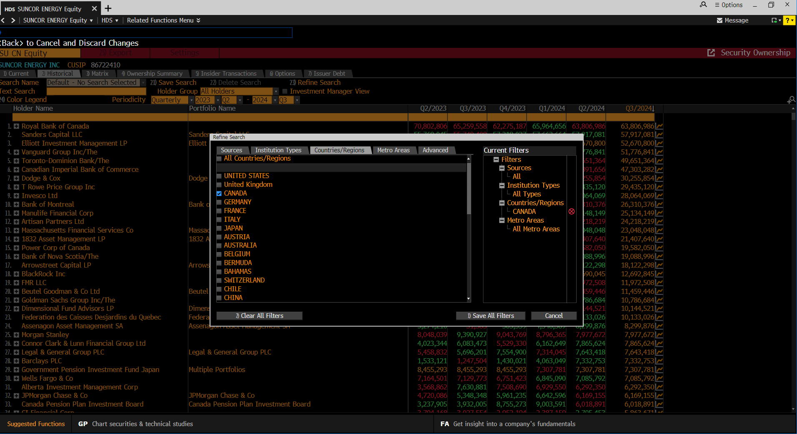
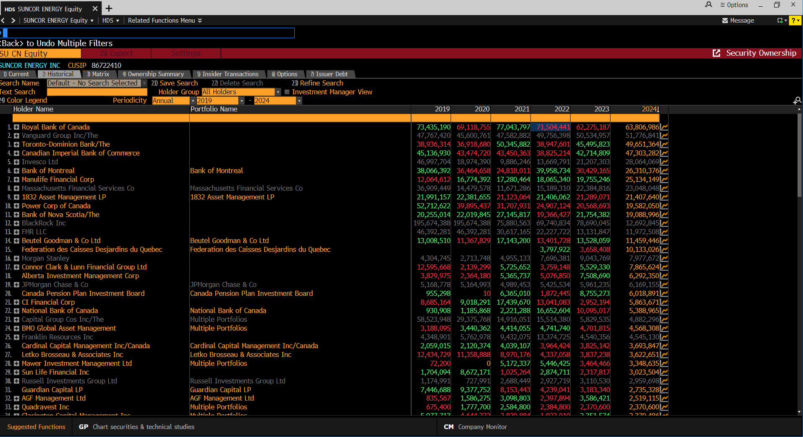

Here’s the updated markdown with placeholder images for each step displayed side by side, but under each text:

---

### README for `bloomberg/`

#### Overview

This directory is a guide for users on how to manually source and retrieve financial and GHG emissions data using the Bloomberg Terminal. It includes images and step-by-step instructions to help users who may not be familiar with the Bloomberg Terminal navigate it effectively.

#### Files

1. **README.md**

   - This document (the one you're reading) provides an overview of the directory and instructions for accessing Bloomberg data.

2. **Images**
   - These images are provided to help guide users visually through the process of navigating Bloomberg Terminal. Each image corresponds to a specific step in the instructions.

#### Instructions for Bloomberg Data Collection

1. **Accessing Bloomberg Terminal**

   - Open the Bloomberg Terminal on your computer.
   - Ensure you are logged in and have access to the appropriate datasets (financials, environmental metrics, etc.).

2. **Retrieving Company Ownership Data**

   To access company ownership data, use the **OWN** function within the Bloomberg Terminal. Follow these steps:

   1. In the Bloomberg Terminal, type `SU CN Equity OWN` (where `SU CN` is the ticker symbol for Suncor Energy in Canada) and press **Enter**.

      
      

   2. You will be taken to the ownership pageview on **tab 4)**, which displays the current ownership summary for the company.

      

   3. To see data from previous years, click on **tab 2)** labeled "Historical." This will allow you to view historical ownership data for the company.

      

   4. Next, refine your search to focus on ownership by Toronto-based financial institutions. Click on **tab 23)** labeled **Refine Search**. Under the **Region** section, select **Canada** to narrow the results to Canadian companies.

      
      

   5. Set the **Periodicity** to **Annual** to retrieve ownership data for the 2022 financial year. This will give you the relevant ownership breakdown by year.

      
      

3. **Manual Entry**

   - If required, you can enter the data you manually retrieved from Bloomberg Terminal into Excel or CSV files. Make sure to hard-code values instead of using dynamic Bloomberg functions, so the data remains static for analysis.

#### Notes

- Ensure that you have access to a Bloomberg Terminal plugin on the machine where you’re running these processes.
- Use the images provided to troubleshoot or verify your steps.
